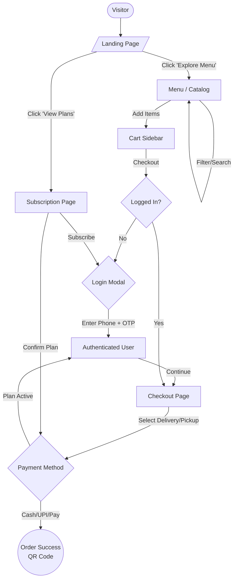

# User Flow Guide - Cafe South Central PWA

**Last Updated:** January 29, 2026

This guide outlines the complete user journey through the Cafe South Central Progressive Web Application, from first visit to order completion and account management.

---

## 📱 Core User Flows

### 1. First-Time Visitor → Order Placement

#### Step 1: Landing Page
**URL:** `/`

**What Users See:**
- Hero section with animated text: "Fresh Food, Made Daily"
- Floating coffee cup parallax elements
- Two primary CTAs:
  - "Explore Menu 🍽️"
  - "View Plans 🌟"
- Category carousel with 8 food categories
- Features section highlighting Traditional Recipes, Rapid Service, Ethical Sourcing
- Footer with links and newsletter signup

**User Actions:**
1. Click "Explore Menu" → Navigate to menu page
2. Click specific category card → Opens menu filtered to that category
3. Click "View Plans" → Navigate to subscription page
4. Click "Login / Sign Up" → Opens login modal

---

#### Step 2: Login (Passwordless)
**Component:** Login Modal

**Flow:**
1. User enters phone number (10 digits)
2. Clicks "Send OTP"
3. Receives 6-digit OTP via SMS
4. Enters OTP in verification field
5. System validates OTP
6. User is logged in, session created
7. Modal closes, user returns to previous page

**Authentication:**
- Session stored in localStorage
- User object contains: `id`, `name`, `phone`, `role`
- All authenticated API calls include user session

---

#### Step 3: Browse Menu
**URL:** `/` (menu section) or filtered view

**Menu Features:**
- **Search Bar:** Real-time search by item name or description
- **Category Filters:** All, South Indian, Dosa, Rice, North Indian, Snacks, Beverages, Chaat, Desserts
- **Bestsellers Section:** Top 3 most-ordered items with medals (🥇🥈🥉)
- **Item Cards Display:**
  - High-quality food image
  - Item name and description
  - VEG/NON-VEG badge
  - Price (₹XX)
  - Inventory status:
    - "SOLD OUT" (red badge, disabled)
    - "Running Out!" (red alert, <5 items)
    - Add to Cart button
  - **Availability Filter:** Items marked inactive by admin are automatically hidden

**User Actions:**
1. Search for specific items
2. Filter by category
3. Click "Add to Cart" → Item added, counter appears
4. Use +/- buttons to adjust quantity
5. View cart icon → Shows item count

---

#### Step 4: Cart & Checkout
**Component:** FloatingCart (bottom-right on desktop, bottom on mobile)

**Cart Display:**
- List of all items with quantities
- Subtotal calculation
- Remove item button (trash icon)
- "Checkout" button

**Checkout Flow:**
1. Click "Checkout"
2. **Delivery Options:**
   - Pick Up (default)
   - Dine In
   - Delivery (requires address)
3. **Schedule Order:**
   - Now (default)
   - Later → Date/time picker
4. **Special Instructions:** Optional text field
5. **Payment Method:**
   - Cash on Delivery (default)
   - Online Payment
6. **Address Selection:** (if Delivery chosen)
   - Select from saved addresses
   - Add new address
7. Review order summary
8. Click "Place Order"
9. Order confirmation → Redirect to `/orders`

**Validation:**
- Minimum order value check
- Inventory availability check
- Address required for delivery
- Phone number required

#### Visual Flow Diagram


---

### 2. Subscription User Flow

#### Step 1: View Subscription Plans
**URL:** `/subscription`

**Plans Display:**
- **Trial Plan** (₹399/month)
  - 1 meal/day
  - 30-day duration
  - All menu items included
- **Premium Plan** (₹699/month)
  - 2 meals/day
  - 30-day duration
  - Priority service

**User Actions:**
1. Click "Subscribe Now" on desired plan
2. If not logged in → Login modal appears
3. After login → Confirm subscription
4. Payment processing
5. Subscription activated

---

#### Step 2: Daily Meal Selection
**URL:** `/` (subscription mode)

**Subscription Menu:**
- Same interface as normal menu
- "Included in Plan" instead of price
- Quota indicator: "1/2 meals selected"
- Can't exceed daily quota

**Flow:**
1. Browse subscription-eligible items
2. Add items up to quota (1 or 2 meals)
3. Schedule delivery time
4. Confirm selection
5. Meals delivered daily

#### Visual Flow Diagram
```mermaid
graph TD
    %% Nodes
    User([User/Visitor])
    SubPage[Subscription Page <br/> /subscription]
    Login{Logged In?}
    LoginModal[Login Modal]
    Payment[Payment Gateway]
    ActiveSub((Subscription Active))
    
    MenuSub[Menu <br/> (Subscription Mode)]
    CartSub[Cart]
    QuotaCheck{Quota Check <br/> Daily Limit}
    Schedule[Schedule Delivery]
    Confirm[Confirm Order]
    Success((Order Placed <br/> No Payment Needed))

    %% Flow 1: Purchasing Subscription
    User --> SubPage
    SubPage -->|Select Plan| Login
    Login -- No --> LoginModal
    LoginModal -->|Auth Success| Payment
    Login -- Yes --> Payment
    Payment -->|Payment Success| ActiveSub

    %% Flow 2: Using Subscription (Daily Meal)
    ActiveSub -->|Go to Menu| MenuSub
    MenuSub -->|'Included in Plan'| MenuSub
    MenuSub -->|Add Item| QuotaCheck
    
    QuotaCheck -- Limit Exceeded --> Alert[Show Error/Alert]
    QuotaCheck -- Within Limit --> CartSub
    
    CartSub -->|Checkout| Schedule
    Schedule --> Confirm
    Confirm --> Success
```

---

### 3. Account Management Flow

#### Profile Page
**URL:** `/account`

**Sections:**

##### 1. Profile Information
- Avatar (5 preset options)
- Name, Phone, Email
- Edit mode: inline form
- Save/Cancel actions

##### 2. Saved Addresses
- **List View:** Label, full address, primary badge
- **Actions:**
  - Add New Address (modal)
  - Edit Address (modal)
  - Remove Address (confirmation)
  - Set Primary (updates database)

**Address Form Fields:**
- Label: Dropdown (Home, Work, Other)
- Street, City, State, ZIP code
- Validation: all required

##### 3. Payment Methods
- **List View:** Card type, masked number (****1234), expiry
- **Actions:**
  - Add New Card (modal)
  - Edit Card (modal)
  - Remove Card (confirmation)
  - Set Primary

**Card Form Fields:**
- Card Type: Dropdown (Visa, MasterCard, Rupay, AmEx)
- Last 4 Digits: Numeric input (max 4)
- Expiry Month/Year: Number inputs
- Cardholder Name: Optional

##### 4. Loyalty & Rewards
- **Points Display:** Large centered number
- **Tier System:**
  - 🥉 Bronze: 0-499 points (Orange badge)
  - 🥈 Silver: 500-999 points (Gray badge)
  - 🥇 Gold: 1000-1999 points (Yellow badge)
  - 💎 Platinum: 2000+ points (Indigo badge)
- **Progress:** "X points to next tier"
- **Action:** View Rewards Program

**Points Earning:**
- Automatically awarded on order completion
- Different rates for subscription vs normal orders

##### 5. Current Plan (if subscribed)
- Plan type and status
- Next billing date
- Manage/Cancel buttons

##### 6. Quick Links
- Order History → `/orders`
- Subscription Plans → `/subscription`
- Send Feedback → `/?feedback=true`

**Navigation:**
- Logout button (confirmation)
- Mobile: Hamburger menu access

---

### 4. Order Tracking Flow

#### Order History Page
**URL:** `/orders`

**Display:**
- **Filters:**
  - Date range picker (calendar)
  - Status filter: All, Completed, Cancelled, Preparing, Ready
- **Order Cards:** (not table)
  - Order ID, date, time
  - Status badge (color-coded):
    - Preparing: Blue
    - Ready: Green
    - Completed: Gray
    - Cancelled: Red
  - QR code status tracking
  - Items list (collapsible)
  - Total amount
  - Delivery method

**User Actions:**
1. Filter by date/status
2. Expand order to view items
3. View receipt
4. Cancel order (within 2 minutes only)
5. Reorder (adds items to cart)

---

## 🔧 Admin Workflows

### Admin Dashboard Access
**URL:** `/admin/dashboard`
**Role Required:** `ADMIN`

**Navigation Tabs:**
- Live Orders
- New Order (POS)
- Members
- Stock
- History
- Feedback
- Analytics

---

### Stock Management

**Features:**
- Real-time inventory tracking
- Active/Inactive toggle per item
- Stock count adjustment (+/-)
- "Sold Out" quick action
- **Normal mouse wheel scrolling** (Lenis disabled on admin pages)

**Item Availability Sync:**
1. Admin unchecks "Active" checkbox → `isAvailable = false` in database
2. Item immediately hidden from user-facing menu
3. Users cannot see or order inactive items
4. Admin checks "Active" → Item reappears in user menu
5. Changes sync within 5 seconds (polling interval)

**Workflow:**
1. Navigate to Stock tab
2. View all menu items with current inventory
3. Toggle "Active" checkbox to control visibility
4. Use +/- buttons to adjust stock count
5. Click "Sold Out" for instant deactivation
6. Click "Undo" to reactivate sold-out items

**Use Cases:**
- Daily menu management (activate breakfast items, deactivate lunch)
- Handle ingredient shortages (mark items inactive)
- Seasonal menu updates
- Special event catering (show only specific items)

---

### Order Management

**Live Orders Tab:**
- Real-time order feed
- Status update buttons:
  - Mark as Preparing
  - Mark as Ready
  - Mark as Completed
  - Cancel (with reason)
- Order details: items, customer, delivery info
- Timer showing order age

**Point of Sale (POS):**
- Admin can place orders for walk-in customers
- Same menu interface with search
- Select items, quantities
- Choose customer or create guest order
- Process payment (cash/card)
- Generate receipt

---

## 🎨 Design Consistency

**Color Palette:**
- Background: `#FBFAF9` (light beige)
- Cards: `#fdf9ee` (warm cream/beige)
- Primary: `#5C3A1A` (brown)
- Accents: Tier-based colors

**Typography:**
- Headings: Bold, 1.125rem - 1.875rem
- Body: 0.875rem - 0.9375rem
- Labels: 0.75rem uppercase

**Responsive Breakpoints:**
- Mobile: < 768px
- Tablet: 768px - 1024px
- Desktop: > 1024px

---

## 🔒 Authentication & Security

**Session Management:**
- Passwordless OTP login
- Session stored in localStorage
- 30-day expiration
- Auto-logout on token expiry

**Protected Routes:**
- `/account` → Requires login
- `/orders` → Requires login
- `/admin/*` → Requires ADMIN role
- `/subscription` → Accessible to all (prompts login on subscribe)

**API Security:**
- All user-specific endpoints validate session
- Admin endpoints check role
- CORS configured for production
- Input validation on all forms

---

## 📊 Data Flow

### Order Creation
1. User adds items to cart (client-side state)
2. Clicks checkout → Form validation
3. Submit to `POST /api/orders`
4. Backend:
   - Validates inventory
   - Checks user session
   - Creates Order record
   - Updates inventory counts
   - Sends confirmation SMS
5. Returns order ID & details
6. Client redirects to `/orders`

### Inventory Updates
1. User views menu → `GET /api/menu`
2. Every 5 seconds: re-fetch menu data
3. Admin changes stock/availability → Database update
4. Next user fetch reflects changes
5. **Real-time sync:** Inactive items filtered out

### Loyalty Points
1. Order completed → Trigger points award
2. `POST /api/user/loyalty` with points
3. Backend calculates new tier
4. Updates `LoyaltyPoints` record
5. User sees updated points on next profile visit

---

## 🚀 Performance Optimizations

**Client-Side:**
- React component memoization
- Lazy loading for images
- Debounced search input
- Optimistic UI updates

**Server-Side:**
- Database connection pooling
- Query optimization with indexes
- API response caching (where appropriate)
- Pagination for large datasets

**Smooth Scrolling:**
- Lenis enabled on all routes EXCEPT `/admin/*`
- Normal mouse wheel on admin pages for better UX
- Parallax effects on landing page only

---

## 📱 Mobile Optimizations

**Touch-Friendly:**
- Minimum button size: 44x44px
- Swipe gestures for modals
- Bottom-aligned primary actions
- Floating cart for easy access

**Performance:**
- Reduced animations on mobile
- Smaller image sizes
- Lazy loading below fold
- Service worker for offline capability (PWA)

---

## 🔮 Future Enhancements

1. **Push Notifications:**
   - Order status updates
   - Daily meal reminders for subscribers
   - Promotional offers

2. **Advanced Analytics:**
   - User behavior tracking
   - A/B testing for menu items
   - Conversion funnel analysis

3. **Social Features:**
   - Share favorite items
   - Refer-a-friend program
   - Reviews and ratings

4. **Payment Integration:**
   - Razorpay/Stripe gateway
   - Wallet balance usage
   - Split payments

5. **Delivery Tracking:**
   - Live GPS tracking
   - Delivery partner assignment
   - ETA calculations

---

## 📝 Summary

This PWA provides a complete food ordering experience with:

✅ **Seamless user journey** from landing to order completion  
✅ **Passwordless authentication** for quick access  
✅ **Flexible ordering** (immediate, scheduled, subscription)  
✅ **Comprehensive account management** (addresses, payments, loyalty)  
✅ **Real-time inventory sync** between admin and users  
✅ **Admin-friendly stock management** with normal scrolling  
✅ **Responsive design** optimized for all devices  
✅ **Performance-focused** with smooth animations and fast load times  

The application is production-ready and continuously improving based on user feedback!
